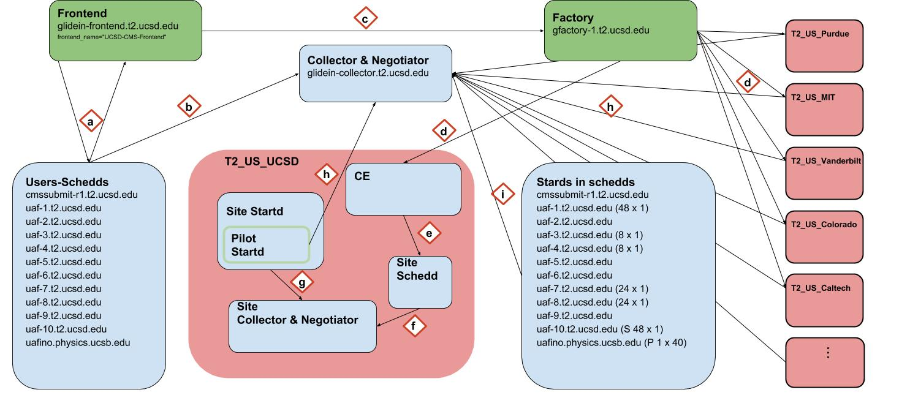

# General diagram

**a**. The Frontend queries the schedds for idle jobs 
**b**. The schedds advertise its jobs' classAds to the Collector 
**c**. The Frontned request pilots to the factory 
**d**. The Factory sends pilots to the Sites' Gatekeepers 
**e**. The pilot gets queued into the Site's local batch system 
**f**. Similar to (b) but it happens inside the Site's local batch(in case it is condor) 
**g**. The Startds advertise themselves to the Collector 
**h**. Inside a Site Startd a pilot starts and in turn executes a pilot Startd that will advertise itself not to the Site's Collector as in (g) but the global one.  
